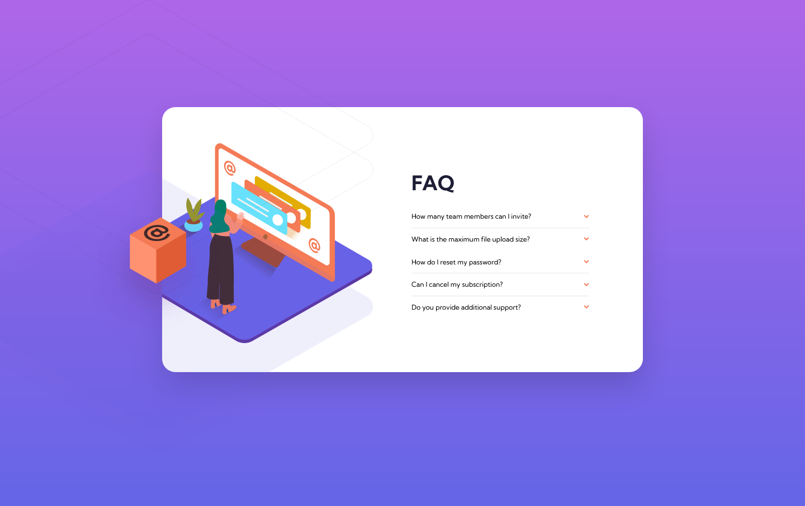

# Frontend Mentor - FAQ accordion card solution

This is a solution to the [FAQ accordion card challenge on Frontend Mentor](https://www.frontendmentor.io/challenges/faq-accordion-card-XlyjD0Oam).

## Table of contents

- [Overview](#overview)
  - [The challenge](#the-challenge)
  - [Screenshot](#screenshot)
  - [Links](#links)
- [My process](#my-process)
  - [Built with](#built-with)
  - [What I learned](#what-i-learned)
  - [Continued development](#continued-development)
  - [Useful resources](#useful-resources)
- [Author](#author)
- [Acknowledgments](#acknowledgments)

## Overview

### The challenge

Users should be able to:

- View the optimal layout for the component depending on their device's screen size
- See hover states for all interactive elements on the page
- Hide/Show the answer to a question when the question is clicked

### Screenshot



### Links

- Solution URL: [FrontendMentor.io](https://www.frontendmentor.io/solutions/faq-accordion-card-challenge-with-tailwind-and-js-ykHImZvBL)
- Live Site URL: [Vercel](https://prj-05-faq-accordion-card.vercel.app/)

## My process

### Built with

- Semantic HTML5 markup
- CSS custom properties
- Flexbox
- CSS Grid
- Mobile-first workflow
- [tailwindCSS](https://tailwindcss.com/) - CSS library

### What I learned

Using multiple images in same container with position absolute:
```html
<div class="lg:basis-1/2">
  
  
  
</div>
```

How to customize the position for background images:

```js
module.exports = {
  content: ["./index.html", "./src/**/*.{vue,js,ts,jsx,tsx}"],
  theme: {
    extend: {
      backgroundPosition: {
        original: "left -20rem top -10rem",
        secondary: "left -6rem top 4rem",
      },
    },
  },
  plugins: [],
};
```
How to rotate image at click events in Javascript:
```js
 if (!clickedElement) {
      e.target.style.fontWeight = "bold";
      answers[index].style.display = "block";
      icons[index].style.transform = "rotate(180deg)";
      clickedElement = !clickedElement;

    } else {
      e.target.style.fontWeight = "normal";
      answers[index].style.display = "none";
      icons[index].style.transform = "rotate(360deg)";
      clickedElement = !clickedElement;

    }
```

### Continued development

Future projects will be developed using TailwindCSS and vanilla Javascript when interactivity must be included.

### Useful resources

- [tailwindcss -Customizing your theme - Background position](https://tailwindcss.com/docs/background-position#customizing-your-theme)
- [Customizing Colors in TailwindCSS](https://tailwindcss.com/docs/customizing-colors) - Adding personalized color names to be used in tailwindcss.
- [Customizing Fonts in TailwindCSS](https://tailwindcss.com/docs/font-family#using-custom-values) - Adding Google fonts to be used in tailwindcss.

## Author

- Website - [Gustavo Sanchez](https://www.gusanche.dev)
- Frontend Mentor - [@gusanchedev](https://www.frontendmentor.io/profile/gusanchedev)
- Github - [@gusanchedev](https://www.github.com/gusanchedev)
- Twitter - [@gusanchedev](https://www.twitter.com/gusanchedev)
- Linkedin - [gusanchedev](https://www.linkedin.com/in/gusanchedev/)

## Acknowledgments

Thanks to Mariapaz for being my friend and support 💙
